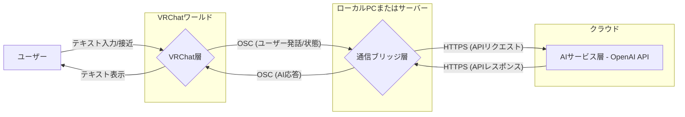

## VRChat AIコンパニオン通信システム 全体設計仕様書

### 1. システム概要

本システムは、VRChat内でユーザーがAIキャラクターとテキストベースで対話できる最小限の機能を提供します。既存技術を最大限に活用し、シンプルな構成で迅速な構築を目指します。

#### 1.1 目的
- VRChat内での基本的なAIテキスト対話体験の実現
- 関心の分離を徹底したシンプルなアーキテクチャの構築
- セットアップと拡張が容易なシステムの提供

---

### 2. システムアーキテクチャ

#### 2.1 全体構成
システムは以下の3つの主要コンポーネントで構成されます。

```
[VRChat層 (UdonSharp)]    [通信ブリッジ層 (Node.js)]    [AIサービス層 (OpenAI API)]
```

- **VRChat層**: ユーザーインターフェース、VRChat内イベント処理、OSC送受信を担当
- **通信ブリッジ層**: OSCメッセージとOpenAI API間のメッセージ中継・変換を担当
- **AIサービス層**: AIによる応答テキスト生成を担当

#### 2.2 コンポーネント図



---

### 3. コンポーネント詳細設計

#### 3.1 VRChat層

- **役割**:
    - ユーザーがAIキャラクターに近づいたこと/離れたことを検知
    - ユーザーのテキスト入力を取得
    - 取得した情報をOSCメッセージとして通信ブリッジ層へ送信
    - 通信ブリッジ層から受信したAI応答テキストをVRChat内で表示
- **実装技術**:
    - UdonSharp (単一スクリプト)
    - VRChat OSC機能
- **主要処理**:
    - `OnPlayerTriggerEnter`/`OnPlayerTriggerExit`: ユーザー接近/離脱検知、OSC送信 (`/avatar/parameters/userNearby`)
    - VRChat UI (例: `VRCUiInputField`) からの入力イベント: テキスト取得、OSC送信 (`/avatar/parameters/userSpeech`)
    - OSC受信処理: 受信したAI応答 (`/avatar/parameters/aiResponse`) を `UnityEngine.UI.Text` などに表示
    - OSC受信処理: 受信したAI発話状態 (`/avatar/parameters/aiSpeaking`) をアバターのアニメーション等に反映 (オプション)

#### 3.2 通信ブリッジ層

- **役割**:
    - VRChat層からのOSCメッセージを受信
    - 受信したユーザー発話テキストをOpenAI APIへのリクエスト形式に整形
    - OpenAI APIへHTTPSリクエストを送信し、応答を受信
    - OpenAI APIからの応答テキストをOSCメッセージ形式に整形し、VRChat層へ送信
- **実装技術**:
    - Node.js (単一スクリプト `bridge.js`)
    - `node-osc` ライブラリ (OSC送受信)
    - `axios` または `node-fetch` ライブラリ (HTTPSリクエスト)
    - `dotenv` ライブラリ (APIキー等の環境変数管理)
- **主要処理**:
    - OSCサーバー起動、指定ポートでメッセージ待受
    - `/avatar/parameters/userSpeech` 受信時:
        - メッセージ内容をOpenAI API (Chat Completions) 形式に整形
        - システムプロンプト (例: 「あなたは親しみやすいAIコンパニオンです。短く応答してください。」) を付加
        - OpenAI APIへ送信、応答取得
        - 応答テキストを `/avatar/parameters/aiResponse` としてOSC送信
        - (オプション) 発話開始/終了を示す `/avatar/parameters/aiSpeaking` (bool) を送信
    - 環境変数 (`.env`ファイル) からOpenAI APIキーを読み込み

#### 3.3 AIサービス層

- **役割**:
    - 入力されたテキストプロンプトに基づき、自然な応答テキストを生成
- **実装技術**:
    - OpenAI API (例: `gpt-3.5-turbo`)
- **主要処理**:
    - 通信ブリッジ層からのAPIリクエストに応じてテキスト生成

---

### 4. データモデル設計 (OSCパラメータ)

| パラメータ名    | 方向        | 型     | 説明                                   |
|-----------------|-------------|--------|----------------------------------------|
| `/avatar/parameters/userNearby` | VRC → ブリッジ | bool   | ユーザーがAIキャラクターの近くにいるか (true/false) |
| `/avatar/parameters/userSpeech` | VRC → ブリッジ | string | ユーザーの発話内容 (テキスト)                  |
| `/avatar/parameters/aiResponse` | ブリッジ → VRC | string | AIの応答テキスト                            |
| `/avatar/parameters/aiSpeaking` | ブリッジ → VRC | bool   | AIが発話中か (true/false) (オプション)       |

*VRChat OSCの制約上、パラメータ名は `/avatar/parameters/` プレフィックスが推奨されます。

---

### 5. インターフェース設計

#### 5.1 VRChat層 ⇔ 通信ブリッジ層
- **プロトコル**: OSC (UDP)
- **ポート**: VRChat OSC標準ポート (送信: 9000, 受信: 9001) またはカスタムポート

#### 5.2 通信ブリッジ層 ⇔ AIサービス層
- **プロトコル**: HTTPS (POSTリクエスト)
- **エンドポイント**: OpenAI APIのエンドポイント (例: `https://api.openai.com/v1/chat/completions`)
- **認証**: HTTPヘッダーにBearerトークン (OpenAI APIキー) を使用

---

### 6. 実装と運用ガイドライン

#### 6.1 セットアップ
1.  **VRChat層**:
    *   作成したUdonSharpスクリプトとOSC送受信設定を持つアバターまたはオブジェクトをワールドに配置。
2.  **通信ブリッジ層**:
    *   Node.jsと必要なnpmパッケージ (`node-osc`, `axios`/`node-fetch`, `dotenv`) をインストール。
    *   `.env`ファイルを作成し、`OPENAI_API_KEY="YOUR_API_KEY"` を設定。
    *   `node bridge.js` を実行してブリッジサーバーを起動。
3.  **AIサービス層**:
    *   OpenAIアカウントとAPIキーを取得。

#### 6.2 制限事項
-   **テキストのみ**: 本ミニマル設計では音声認識・音声合成は対象外。
-   **応答速度**: ネットワーク環境とOpenAI APIの応答速度に依存。目標2秒以内。
-   **コンテキスト長**: OpenAI APIのトークン制限に準拠。ブリッジ層で履歴管理は行わない（ステートレス）。

#### 6.3 セキュリティ
-   OpenAI APIキーは `.env` ファイルで管理し、リポジトリ等に含めない。
-   通信ブリッジはローカルPCまたは信頼できるサーバーで実行。

---

### 7. 完成の定義 (MVP)

-   ユーザーがVRChat内でAIキャラクターに近づき、テキストチャットで話しかけると、AIから適切なテキスト応答が2～3秒以内に返ってくる。
-   必要なファイルは、UdonSharpスクリプト1つ、Node.jsスクリプト1つ、`.env`ファイル1つのみ。
-   提供されるセットアップ手順に従い、1時間以内に動作確認が可能であること。
-   追加の外部サービス契約 (OpenAI API以外) や複雑なサーバー構築が不要であること。

---

この設計は、初期リクエストの「Minimal Value Product」「関心の分離」を重視し、具体的なコンポーネントとデータフローをミニマルに定義したものです。
